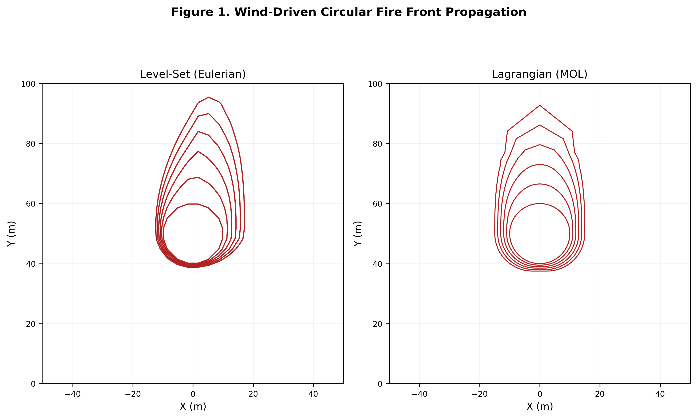
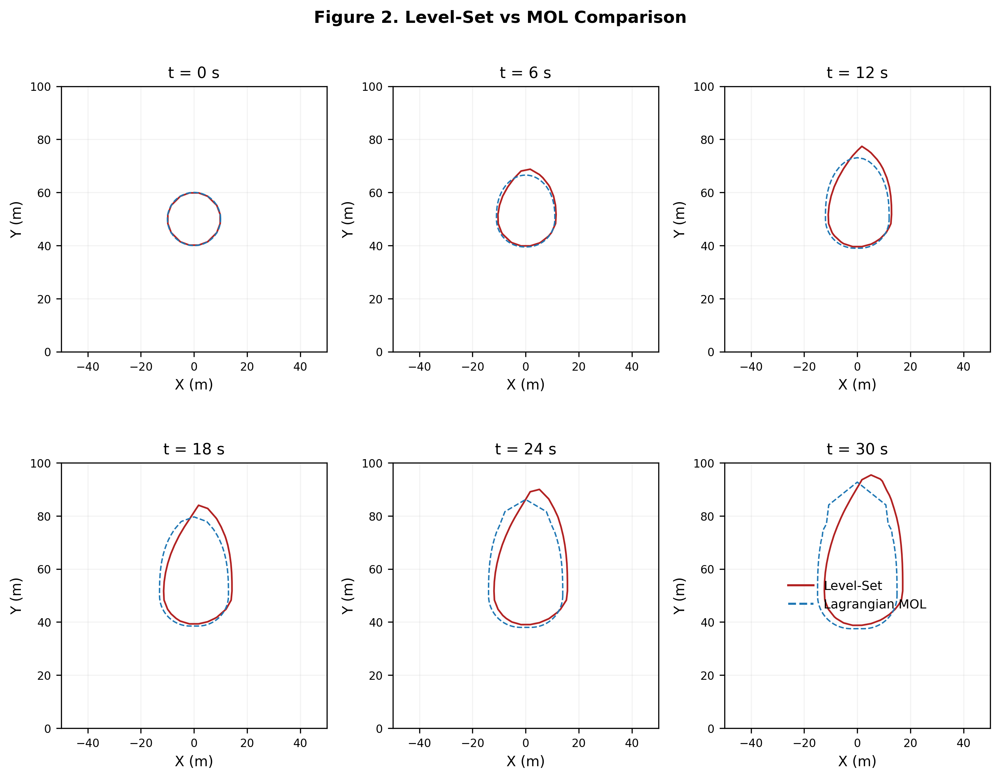
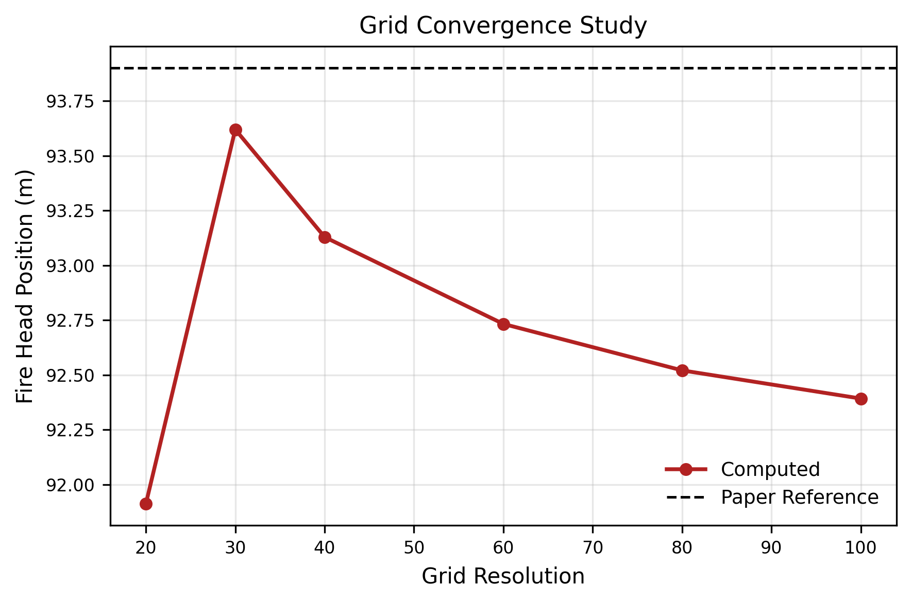

# Fire-Front Propagation using the Level-Set Method

## Overview

This project reproduces a published NIST fire-front propagation benchmark using the Eulerian Level-Set Method.

## Features

- Eulerian Level-Set formulation
- Flux-limited upwind discretization
- SSP-RK2 time integration

## Tools Used

- Python
- NumPy
- Matplotlib
## Results

### Wind-Driven Circular Fire Front

### Level-Set vs MOL Comparison

### Grid Convergence Study

